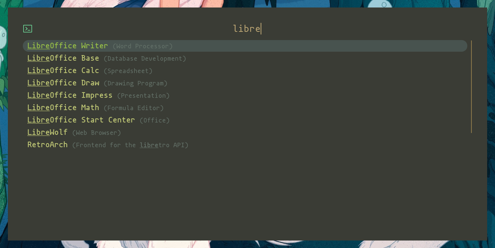
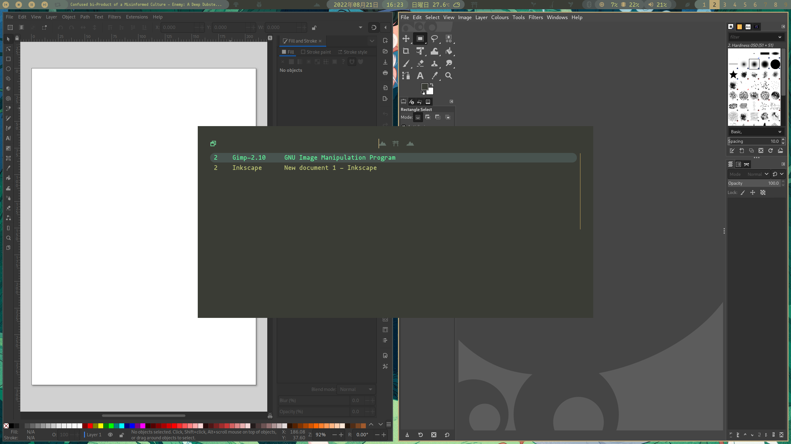

# Mokujin Rofi Theme
A theme for [rofi](https://github.com/davatorium/rofi) based on the Mokujin colorway

 


## About
Just a simple .rasi theme file made using rofi 1.7.4.  Should be compliant with new file format.  I only use rofi for a launcher so not much attention has been paid to other features like ssh and file browser.


## Screenshots



<sub>wallpaper credit: Dani Pendergast (www.danipendergast.com)</sub>

## Requirements
- **mononoki Nerd Fonts** or **Nerd Fonts Complete**


## Installation
### Fonts
For arch users the Nerd Fonts can be found in **aur**.

```
yay -S nerd-fonts-complete
```

### Theme
Just drop the file into your rofi theme directory, i.e. `~/.config/rofi/themes/`.  You can switch to it by editing the main `config.rasi` or running `rofi-theme-switcher`.


## Troubleshooting
If you're experiencing text rendering issues, make sure the necessary font packages in the requirements section are installed and update your font cache with `fc-cache -f`.  


## License
This software is licensed under the GNU General Public License v3+.  See LICENSE for details.
